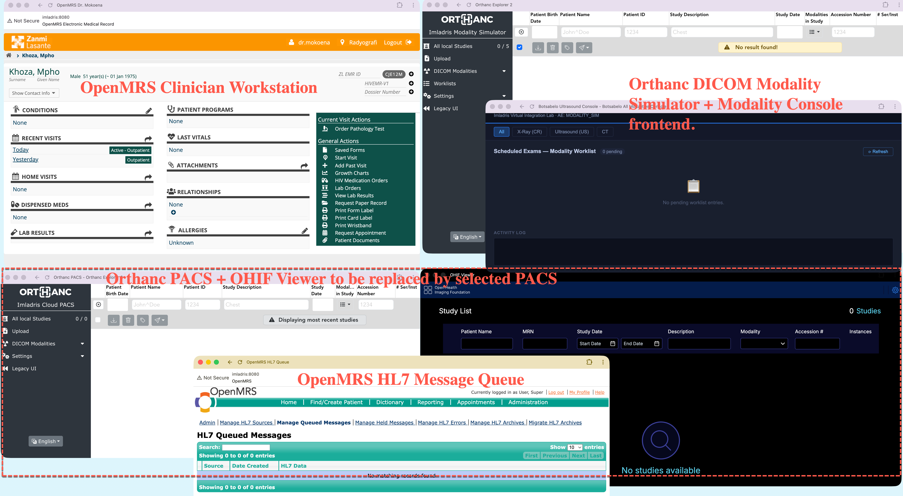

# Demo Startup — Imladris Virtual Integration Lab

## Prerequisites

### Confirm a clean teardown of any prior demos (end of this doc)

- Make sure all containers stopped and removed.
```
docker ps
```
else shut down the stack again

```bash
cd ~/git/Fastpilot/imladris/docker
docker compose --profile full down
```
Send a Ctrl-C if this appears to hang, then
```
docker ps
```
to confirm there are no zombies.

- Docker Desktop running
- Java 11 active (`export JAVA_HOME=$(/usr/libexec/java_home -v 11)`)

---

## Step 1 — Start Docker stack

```bash
cd ~/git/Fastpilot/imladris/docker
docker compose --profile full up -d
```

Services started:

| Service | name | URL |
|---------|------|-----|
| MySQL 8.0 | imladris-mysql | http:localhost:3306 |
| Orthanc modality (MWL + simulator) | imladris-modality | http://localhost:8042 |
| Orthanc cloud PACS | imladris-pacs | http://localhost:8043 |
| OHIF viewer | imladris-ohif | http://localhost:3000 |
| Modality console | http://localhost:5001 |
| PACS Proxy | imladris-pacs-proxy | http://localhost:8044 |
| IMLADRIS sidecar for the modalities | imladris-sidecar | http://localhost:5001 |

---

## Step 2 — Start OpenMRS

```bash
export JAVA_HOME=$(/usr/libexec/java_home -v 11)
cd ~/git/Fastpilot/imladris/openmrs/openmrs-distro-zl
mvn openmrs-sdk:run -DserverId=imladris01
```
This can take a minute or two, so start this before the demo.

Wait for: `INFO: Server startup in [N] milliseconds`  
Verify: http://localhost:8080/openmrs (login: admin / Admin123)

---

## Step 4 - Setup the screen layout.

- Log into the OpenMRS clinician window as dr.mokoena.
- Log into the lower center HL7 window as admin.
- Chose the 'Radyografia' location for both.  Answer 'Not now' to the prompt for MFA.
- In the HL7 window, navigate using the back arrow back to the HL7 Queued Messages page.
- Do a hard refresh on the Orthanc and OHIF windows.
- If you see any pending studies in Orthanc, delete them.

---

## Step 3 — Clear stale worklist entries

If you see any pending worklist entries in the Orthanc Modality Simulator or the Modality Console frontend,
clear them. Should not be necessary if there was a clean teardown prior.

```bash
# Remove any leftover .wl files
docker exec imladris-modality sh -c "rm -f /worklist/*.wl"

# Reset order poller state to now so prior orders don't replay
docker exec imladris-sidecar sh -c \
  'echo "{\"last_polled\": \"$(date -u +%Y-%m-%dT%H:%M:%S.000+00:00)\"}" \
  > /data/order_poller_state.json'
```

---

## Step 4 — Verify sidecar is running

You will see the 'sidecar' Modality Console up and running.  If the window refreshed you know it is active.

```bash
docker logs imladris-sidecar --tail 20
```

Look for:
- `Order poller starting`
- `PACS change watcher started`
- `Modality console starting on port 5001`

---
## Step 5 — Confirm clean state and inital screen layout.

If they do not already exist from a prior demo, create browser windows for each UI and log in to OpenMRS as dr.mokoena.  Create another browser instance so you can log in as admin and show the [(HL7 Queued Messages)(http://localhost:8080/openmrs/admin/hl7/hl7InQueuePending.htm)]

This is a good layout, with the team collab / confluence / jira window in upper left and the admin HL7 window at lower right.


- **OHIF** (http://localhost:3000) — no studies visible
- **Modality console** (http://localhost:5001) — worklist empty
- **Orthanc modality** (http://localhost:8042) — no studies, worklist empty
- **Orthanc PACS** (http://localhost:8043) — no studies
- **OpenMRS HL7 queue** (http://localhost:8080/openmrs/admin/hl7/hl7InQueuePending.htm) — no queued messages

Confirm that the screen matches this. 

---
## Demo workflow

Use this diagram with the numeric graphical labels 

1. **OpenMRS** — log in as dr.mokoena, open patient, place US and CR radiology orders for 7RHG9J, Tsepang Molapo.
2. **Modality console** (http://localhost:5001) — order appears within ~10 sec, click **Image the Patient**
3. **Orthanc modality** (http://localhost:8042) — study appears in the All local studies list. Use the paper airplane icon to send to  CLOUD PACS.
4. **Orthanc PACS**  (http://localhost:8043) — study appears in PACS study list within ~15sec.  Reload page if needed.
5. **OHIF** (http://localhost:3000) — study appears in OHIF study list. Reload page if needed.
5. **OpenMRS HL7 queue** (http://localhost:8080/openmrs/admin/hl7/hl7InQueuePending.htm) — ORU^R01 result message arrives within ~15 sec of study reaching PACS.  Reload page if needed.

---

## Teardown

Make sure you are running in the configured python venv.

```
source .imladris_venv/bin/activate
```

**1. Delete all studies from Orthanc PACS** (http://localhost:8043) via the web UI.
OHIF studies clear automatically on next stack restart — no manual OHIF cleanup needed.


**2. Reset the worklist and order poller state:**

```bash
# Remove .wl files
docker exec imladris-modality sh -c "rm -f /worklist/*.wl"

# Reset order poller state to now so prior orders don't replay on next startup
docker exec imladris-sidecar sh -c \
  'echo "{\"last_polled\": \"$(date -u +%Y-%m-%dT%H:%M:%S.000+00:00)\"}" \
  > /data/order_poller_state.json'
```

**3. Clear out all demo orders:***
```
python tools/clear_demo_orders.py
```

To test this utility you can do:
```
python tools/clear_demo_orders.py --dry-run    # preview
python tools/clear_demo_orders.py              # purge all (last 7 days)
python tools/clear_demo_orders.py --patient 7RHG9J   # one patient only
```

**4. Close all open visits:***

```
python tools/close_demo_visits.py                    # close all open visits
```

To test this utility, you can:
```
python tools/close_demo_visits.py --dry-run          # preview
python tools/close_demo_visits.py                    # close all open visits
python tools/close_demo_visits.py --patient 7RHG9J   # one patient only
```

**4. Clear out all OpenMRS orders:***

```
python tools/clear_hl7_queue.py
```

**5. Shut down the stack:**

```bash
cd ~/git/Fastpilot/imladris/docker
docker compose --profile full down
```

**6. Stop OpenMRS** — `Ctrl+C` in the Maven terminal.

---

## Demo polling intervals (already configured)

Polling has been shortened for demo responsiveness.
To restore production settings after the demo, edit `docker/docker-compose.yml`:

```yaml
POLL_INTERVAL_MINUTES: 5    # restore from 0.25
ORDER_POLL_SEC: 30           # restore from 10
```

Then restart the sidecar:

```bash
docker compose --profile full up -d modality-sidecar
```
