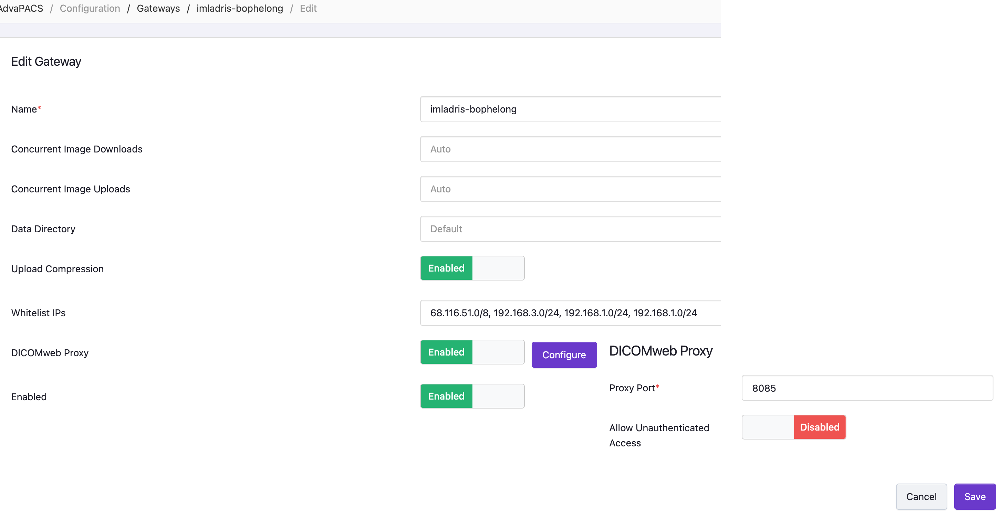
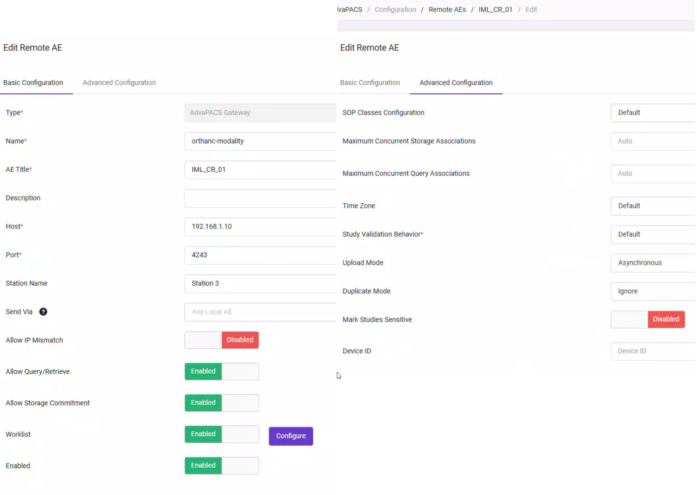
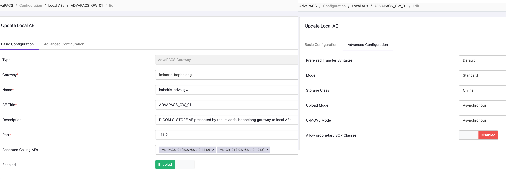

# Configuring AdvaPACS for the Imladris Lab

## Terminology: Local AE vs Remote AE

AdvaPACS uses these terms from the **cloud server's perspective**, which is the reverse of
how most on-premises DICOM tools define them:

| AdvaPACS term | Meaning | Example |
|---------------|---------|---------|
| **Local AE**  | An AET the AdvaPACS Gateway presents **to the local network** — i.e., a DICOM C-STORE SCP the gateway runs on the local host | `ADVAPACS_GW_01` on port 11112 |
| **Remote AE** | An AET on the **local network** that the gateway communicates with — i.e., a modality or Orthanc instance | `IML_CR_01`, `IML_PACS_01` |

The gateway acts as a bridge: local-network systems push studies to the **Local AE** via
C-STORE, and the gateway forwards them to AdvaPACS cloud. The **Remote AE** entries tell
the gateway how to reach back to those local systems for C-ECHO verification and C-MOVE.

---

## Gateway: imladris-bophelong

**Path:** Configuration → Gateways → imladris-bophelong → Edit



| Field | Value | Notes |
|-------|-------|-------|
| Name | `imladris-bophelong` | |
| Concurrent Image Downloads | Auto | |
| Concurrent Image Uploads | Auto | |
| Upload Compression | Enabled | Reduces upstream bandwidth |
| Whitelist IPs | `68.116.51.0/8, 192.168.3.0/24, 192.168.1.0/24` | Home WAN + VPN + LAN |
| DICOMweb Proxy | Enabled | Proxy port **8085**; unauthenticated access disabled |
| Enabled | Enabled | |

The DICOMweb Proxy on port 8085 is used by Orthanc's `AdvaPACS_GW` DICOMweb server entry
(`http://192.168.1.10:8085/rs` in `pacs.json`) as an alternative upload path to the cloud.

---

## Remote AEs (local-network modalities)

Remote AEs are Orthanc instances (or physical modalities) on the LAN. The gateway uses these
entries to initiate outbound C-ECHO/C-MOVE and to populate the **Accepted Calling AEs**
dropdown on Local AEs.

**Path:** Configuration → Remote AEs → [name] → Edit



### IML_CR_01 — orthanc-modality

| Field | Value |
|-------|-------|
| Type | AdvaPACS Gateway |
| Name | `orthanc-modality` |
| AE Title | `IML_CR_01` |
| Host | `192.168.1.10` (BESSIE) |
| Port | `4242` |
| Station Name | Station 3 |
| Send Via | Any Local AE |
| Allow IP Mismatch | **Enabled** |
| Allow Query/Retrieve | Enabled |
| Allow Storage Commitment | Enabled |
| Worklist | Enabled |
| Enabled | Enabled |

**Advanced:** SOP Classes: Default · Upload Mode: Asynchronous · Duplicate Mode: Ignore

### IML_PACS_01 — orthanc-pacs

Configure identically to `IML_CR_01` with these differences:

| Field | Value |
|-------|-------|
| Name | `orthanc-pacs` |
| AE Title | `IML_PACS_01` |
| Port | `4243` |
| Allow IP Mismatch | **Enabled** |

Host-side DICOM ports on BESSIE (from `docker-compose.yml`):
`orthanc-modality` → `4242:4242`, `orthanc-pacs` → `4243:4242`.

---

## Local AE: ADVAPACS_GW_01

The Local AE is the DICOM C-STORE SCP that the gateway runs on BESSIE's local network
interface. Orthanc instances push studies here; the gateway forwards them to the cloud.

**Path:** Configuration → Local AEs → ADVAPACS_GW_01 → Edit



### Basic Configuration

| Field | Value | Notes |
|-------|-------|-------|
| Type | AdvaPACS Gateway | |
| Gateway | `imladris-bophelong` | |
| Name | `imladris-adva-gw` | |
| AE Title | `ADVAPACS_GW_01` | Max 16 chars (DICOM VR AE) |
| Description | DICOM C-STORE AE presented by the imladris-bophelong gateway to local AEs | |
| Port | `11112` | Must have Windows Firewall inbound rule on BESSIE |
| Accepted Calling AEs | `IML_PACS_01 (192.168.1.10:4242)`, `IML_CR_01 (192.168.1.10:4243)` | Populated from Remote AE entries |
| Enabled | Enabled | |

> **Important:** The "Accepted Calling AEs" dropdown is populated from Remote AE entries —
> you must define a Remote AE first before it appears in this list. The "All" default does
> **not** mean literally all callers; it means all registered Remote AEs. Associations from
> unregistered AETs are rejected with `reason: 3 - calling-AE-title-not-recognized`.

### Advanced Configuration

| Field | Value |
|-------|-------|
| Preferred Transfer Syntaxes | Default |
| Mode | Standard |
| Storage Class | Online |
| Upload Mode | Asynchronous |
| C-MOVE Mode | Asynchronous |
| Allow proprietary SOP Classes | Disabled |

---

## Orthanc Configuration

Both Orthanc instances need `ADVAPACS_GW_01` in their `DicomModalities` so they can
initiate C-STORE to the gateway.

**`docker/orthanc/pacs.json`** and **`docker/orthanc/modality.json`**:

```json
"ADVAPACS_GW_01" : ["ADVAPACS_GW_01", "192.168.1.10", 11112]
```

Restart both containers after editing:

```powershell
docker compose restart orthanc-modality orthanc-pacs
```

### Windows Firewall

The gateway runs with `network_mode: host` on BESSIE. Docker does **not** automatically
create Windows Firewall rules for host-networked containers. Add the rule once:

```powershell
New-NetFirewallRule -DisplayName "Imladris advapacs-gateway (11112)" `
    -Direction Inbound -Protocol TCP -LocalPort 11112 -Action Allow
New-NetFirewallRule -DisplayName "Imladris advapacs-gateway DICOMweb (8085)" `
    -Direction Inbound -Protocol TCP -LocalPort 8085 -Action Allow
```

---

## Testing

### C-ECHO from AdvaPACS cloud → Orthanc (tests Remote AE config)

Use the AdvaPACS admin UI to send a C-ECHO to `IML_PACS_01` and `IML_CR_01`. A successful
echo confirms the gateway can reach back to each Orthanc instance on the LAN.

### C-ECHO from Orthanc → ADVAPACS_GW_01 (tests Local AE config)

```powershell
# From orthanc-pacs (calling AET = IML_PACS_01)
curl.exe -s -u admin:admin -X POST http://localhost:8043/modalities/ADVAPACS_GW_01/echo

# From orthanc-modality (calling AET = IML_CR_01)
curl.exe -s -u admin:admin -X POST http://localhost:8042/modalities/ADVAPACS_GW_01/echo
```

Expected response: `null` (HTTP 200) = success.

### C-STORE from Orthanc → AdvaPACS cloud via gateway

Once C-ECHO passes, trigger a study send from either Orthanc UI or via the REST API:

```powershell
# Send a study from orthanc-pacs to the gateway
curl.exe -s -u admin:admin -X POST http://localhost:8043/studies/<study-id>/send `
  -d '{"Resources":["<study-id>"],"Modality":"ADVAPACS_GW_01"}'
```

Monitor gateway logs for upload progress:

```powershell
docker logs advapacs-gateway --tail 50 -f
```

---

## Troubleshooting

| Symptom | Likely cause | Fix |
|---------|-------------|-----|
| `calling-AE-title-not-recognized` (AET is in accepted list) | `Allow IP Mismatch: Disabled` — Docker bridge NAT makes Orthanc connections appear as `::1` (IPv6 loopback) to the host-networked gateway, not `192.168.1.10` | Enable `Allow IP Mismatch` on the Remote AE |
| `calling-AE-title-not-recognized` (AET not in accepted list) | AET not registered as a Remote AE, or not added to Local AE accepted list | Add as Remote AE, then add to Local AE accepted list |
| `DUL Association Rejected` at TCP level | Port 11112 unreachable | Check `netstat -ano \| findstr ":11112"` and Windows Firewall rule |
| C-ECHO succeeds but C-STORE fails | Study routing or SOP class mismatch | Check gateway logs; verify `Allow proprietary SOP Classes` setting |
| Gateway doesn't pick up new Local AE | Config not yet polled from cloud | Restart `advapacs-gateway` container |
